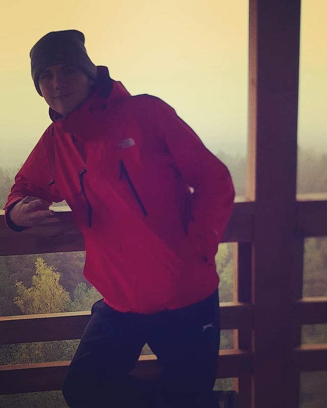

# Mans_CV

## Citāts
*Mans mīļākais citāts,kurš vienmēr pirmais ir atmiņa runājot par citātiem.*
**“Atstāj savu prātu.” Kļūsti amorfs, bezveidīgs kā ūdens. Kad ūdeni lej tasē, tā kļūst par tasi. Kad ūdeni lej tējkannā, tā kļūst par tējkannu. Kad ūdeni ielej pudelē, tas kļūst par pudeli. Ūdens var plūst, bet var sagraut. Esi ūdens, mans draugs.**

## Koda gabals.(No Python)
`''' Kvadrātvienādojuma a x2 + b x + c = 0 sakņu rēķināšana:
D = b2 - 4 a c ,ja D > 0,tad divas saknes,
D = 0, tad viena sakne,
D < 0, tad sakņu nav.

Izveideoja: Artūrs Vaļuks.
'''

from math import sqrt              #Kvadrātsaknes  funkcijas importēšana

print('Kvadrātvienādojuma a x2 + b x + c = 0 sakņu reiķināšana/n')
a = float(input('Ievadiet a, decimaldaļas skaitli: '))
b = float(input('Ievadiet b, decimaldaļas skaitli: '))
c = float(input('Ievadiet c, decimaldaļas skaitli: '))

#Diskriminanta rēķināšana

D =b**2 - 4*a*c   #Diskriminanta formula

#Sakņu rēķināšana

if D == 0 : #Salīdzina diskriminants vienāds ar 0
   x = -(b)/(2*a)     #formula
   print('Diskriminants D = 0, viena sakne,',x,)
else :
    if D > 0 :   #Salīdzina diskriminants lielāks par  0
        x1 = (-(b) + sqrt(D))/(2 * a)    # 1. saknes rēķināšana
        x2 = (-(b) - sqrt(D))/(2 * a)   # 2. saknes rēķināšana

        # 2 sakņu izvade

        print('Diskriminants D > 0, divas saknes x1 =',x1,' un x2 =',x2,)
    else :       #Diskriminants mazāks par 0
        print('Diskriminants D < 0, tad sakņu nav.')
`
## Bilde

## Saraksts
1. Es nodarbojos ar Breiku,jau 8 gadus.
2. Es spēlēju ģitāru no 12 gadiem.
3. Mācos RVT
4. Dzīvoju Tukumā

- [ ] Sociāli aktīvs
- [x] Esmu ambiciozs
- [ ] Draudzīgs
- [x] Regulāri nodarbojos ar sportu

## Tabula
| Nodarbes | Pritoritāte 5 baļu sistēmā |
| Dejošana |             4              |
| mācības  |             3              |
| Draugi   |             4              | 
| Pašattīstība |         3              |
| līdzekļu peļņa |       3              |
| Atpūta|                3              |
---------------------------------------------------------------------------------------------------------------------------------------------------------------------------------
😃😃
😉😉
😀😀
